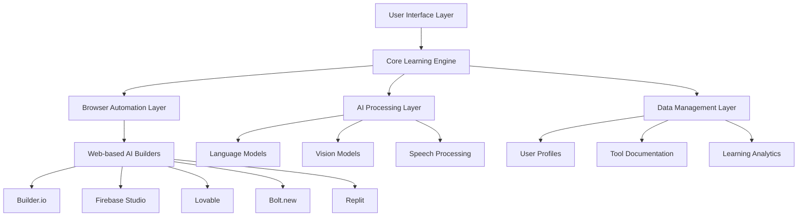

# Design Document

## Overview

Sabi is designed as a multi-layered adaptive learning system that combines browser automation, AI-powered guidance, and real-time user interaction. The architecture leverages browser-use for web automation, integrates multiple AI models for multimodal processing, and provides a rich user interface for interactive learning experiences.

The system operates as a desktop application that can control web browsers, analyze user interactions, provide contextual guidance, and adapt its teaching approach based on user progress and preferences.

## Architecture

### High-Level Architecture



### System Layers

1. **User Interface Layer**: Electron-based desktop application with overlay capabilities
2. **Core Learning Engine**: Orchestrates learning sessions and manages state
3. **Browser Automation Layer**: Controls web browsers using browser-use library
4. **AI Processing Layer**: Handles multimodal AI interactions and decision making
5. **Data Management Layer**: Manages user profiles, documentation, and analytics

## Components and Interfaces

### 1. Core Learning Engine

**Purpose**: Central orchestrator that manages learning sessions, user state, and coordinates between all system components.

**Key Classes**:
- `LearningSessionManager`: Manages active learning sessions
- `LearningPathGenerator`: Creates personalized learning paths
- `ProgressTracker`: Tracks user progress and adapts difficulty
- `ActionExplainer`: Generates real-time explanations for system actions

**Interfaces**:
```typescript
interface ILearningSession {
  id: string;
  userId: string;
  objective: string;
  currentStep: number;
  progress: LearningProgress;
  startLearning(request: LearningRequest): Promise<void>;
  executeNextStep(): Promise<StepResult>;
  explainAction(action: SystemAction): string;
  adaptToUserFeedback(feedback: UserFeedback): void;
}

interface ILearningPath {
  steps: LearningStep[];
  estimatedDuration: number;
  requiredTools: string[];
  generatePath(objective: string, userLevel: SkillLevel): LearningStep[];
}
```

### 2. Browser Automation Layer

**Purpose**: Provides programmatic control over web browsers to interact with AI building tools.

**Key Classes**:
- `BrowserController`: Main interface for browser automation using browser-use
- `ToolNavigator`: Specialized navigation for different AI building tools
- `ActionRecorder`: Records and explains browser actions
- `ErrorHandler`: Handles browser automation errors gracefully

**Interfaces**:
```typescript
interface IBrowserController {
  openTool(toolName: string, config: ToolConfig): Promise<BrowserSession>;
  performAction(action: BrowserAction): Promise<ActionResult>;
  captureScreen(): Promise<Screenshot>;
  explainCurrentState(): Promise<string>;
  handleError(error: BrowserError): Promise<RecoveryAction>;
}

interface IToolNavigator {
  navigateToBuilder(builderType: BuilderType): Promise<void>;
  authenticateUser(credentials: AuthCredentials): Promise<boolean>;
  createNewProject(projectConfig: ProjectConfig): Promise<string>;
  deployProject(projectId: string): Promise<DeploymentResult>;
}
```

### 3. AI Processing Layer

**Purpose**: Handles multimodal AI interactions, natural language processing, and intelligent decision making.

**Key Classes**:
- `MultimodalProcessor`: Processes text, voice, and image inputs
- `IntentAnalyzer`: Analyzes user learning requests and extracts intent
- `ExplanationGenerator`: Generates contextual explanations for actions
- `AdaptiveInstructor`: Adapts teaching style based on user progress

**Interfaces**:
```typescript
interface IMultimodalProcessor {
  processTextInput(text: string): Promise<ProcessedInput>;
  processVoiceInput(audio: AudioBuffer): Promise<ProcessedInput>;
  processImageInput(image: ImageBuffer): Promise<ProcessedInput>;
  generateResponse(input: ProcessedInput, context: LearningContext): Promise<AIResponse>;
}

interface IIntentAnalyzer {
  analyzeRequest(input: string): Promise<LearningIntent>;
  extractObjective(request: LearningRequest): string;
  identifyRequiredTools(objective: string): string[];
  estimateComplexity(objective: string): ComplexityLevel;
}
```

### 4. User Interface Layer

**Purpose**: Provides interactive interface with overlay capabilities, cue cards, tooltips, and modals.

**Key Classes**:
- `OverlayManager`: Manages screen overlays and interactive elements
- `CueCardSystem`: Displays contextual learning cards
- `TooltipManager`: Shows contextual tooltips
- `ModalController`: Handles interactive modals and dialogs

**Interfaces**:
```typescript
interface IOverlayManager {
  showOverlay(content: OverlayContent, position: Position): Promise<void>;
  hideOverlay(overlayId: string): Promise<void>;
  updateOverlay(overlayId: string, content: OverlayContent): Promise<void>;
  captureUserInteraction(interaction: UserInteraction): Promise<void>;
}

interface ICueCardSystem {
  displayCueCard(concept: string, context: LearningContext): Promise<void>;
  updateCueCard(cardId: string, content: CueCardContent): Promise<void>;
  trackCueCardEngagement(cardId: string, engagement: EngagementData): Promise<void>;
}
```

### 5. Data Management Layer

**Purpose**: Manages user profiles, tool documentation, learning analytics, and persistent storage.

**Key Classes**:
- `UserProfileManager`: Manages user learning profiles and preferences
- `DocumentationManager`: Manages tool documentation and resources
- `AnalyticsEngine`: Tracks and analyzes learning progress
- `StorageManager`: Handles data persistence and synchronization

**Interfaces**:
```typescript
interface IUserProfileManager {
  getUserProfile(userId: string): Promise<UserProfile>;
  updateLearningProgress(userId: string, progress: LearningProgress): Promise<void>;
  adaptPreferences(userId: string, feedback: UserFeedback): Promise<void>;
  getRecommendations(userId: string): Promise<LearningRecommendation[]>;
}

interface IDocumentationManager {
  getToolDocumentation(toolName: string): Promise<ToolDocumentation>;
  updateDocumentation(toolName: string, docs: ToolDocumentation): Promise<void>;
  searchDocumentation(query: string): Promise<DocumentationResult[]>;
  validateDocumentationCurrency(toolName: string): Promise<ValidationResult>;
}
```

## Data Models

### Core Data Models

```typescript
interface LearningRequest {
  id: string;
  userId: string;
  objective: string;
  inputType: 'text' | 'voice' | 'image';
  rawInput: string | AudioBuffer | ImageBuffer;
  context?: LearningContext;
  timestamp: Date;
}

interface LearningStep {
  id: string;
  title: string;
  description: string;
  toolRequired: string;
  actions: BrowserAction[];
  explanation: string;
  expectedOutcome: string;
  validationCriteria: ValidationCriteria;
  estimatedDuration: number;
}

interface UserProfile {
  id: string;
  learningStyle: LearningStyle;
  skillLevel: SkillLevel;
  completedProjects: string[];
  preferences: UserPreferences;
  progressHistory: LearningProgress[];
  adaptationData: AdaptationData;
}

interface BrowserAction {
  type: 'click' | 'type' | 'navigate' | 'scroll' | 'highlight';
  target: ElementSelector;
  value?: string;
  explanation: string;
  reasoning: string;
  expectedResult: string;
}

interface ToolDocumentation {
  toolName: string;
  baseUrl: string;
  authenticationMethod: AuthMethod;
  interfaceElements: UIElement[];
  workflows: Workflow[];
  commonIssues: Issue[];
  lastUpdated: Date;
}
```

## Error Handling

### Error Categories and Strategies

1. **Browser Automation Errors**
   - Network connectivity issues
   - Element not found errors
   - Authentication failures
   - Tool interface changes

2. **AI Processing Errors**
   - API rate limits
   - Model unavailability
   - Input processing failures
   - Context understanding errors

3. **User Interface Errors**
   - Overlay rendering issues
   - Input capture failures
   - Screen capture problems
   - User interaction conflicts

### Error Recovery Mechanisms

```typescript
interface IErrorHandler {
  handleBrowserError(error: BrowserError): Promise<RecoveryAction>;
  handleAIError(error: AIError): Promise<FallbackResponse>;
  handleUIError(error: UIError): Promise<UIRecovery>;
  logError(error: SystemError): Promise<void>;
  notifyUser(error: UserFacingError): Promise<void>;
}

enum RecoveryAction {
  RETRY_ACTION = 'retry',
  ALTERNATIVE_APPROACH = 'alternative',
  SKIP_STEP = 'skip',
  REQUEST_USER_INPUT = 'user_input',
  FALLBACK_TO_MANUAL = 'manual'
}
```

## Testing Strategy

### Testing Levels

1. **Unit Testing**
   - Individual component functionality
   - AI model integration tests
   - Data model validation
   - Browser action simulation

2. **Integration Testing**
   - Browser automation workflows
   - AI processing pipelines
   - User interface interactions
   - Data persistence operations

3. **End-to-End Testing**
   - Complete learning session flows
   - Multi-tool navigation scenarios
   - Error recovery workflows
   - User experience validation

4. **Performance Testing**
   - Browser automation speed
   - AI response times
   - Memory usage optimization
   - Concurrent session handling

### Testing Tools and Frameworks

- **Unit Testing**: Jest, Vitest
- **Browser Testing**: Playwright Test, browser-use test utilities
- **AI Testing**: Custom AI model testing framework
- **E2E Testing**: Cypress, Playwright
- **Performance Testing**: Artillery, Lighthouse CI

### Test Data Management

```typescript
interface TestScenario {
  name: string;
  objective: string;
  expectedTools: string[];
  mockUserInputs: UserInput[];
  expectedOutcomes: LearningOutcome[];
  validationCriteria: TestValidation[];
}

interface MockToolEnvironment {
  toolName: string;
  mockResponses: MockResponse[];
  simulatedUI: UISimulation;
  errorScenarios: ErrorScenario[];
}
```

This design provides a comprehensive foundation for building Sabi as an adaptive learning companion that can control browsers, provide real-time guidance, and create personalized learning experiences across various web-based AI building tools.